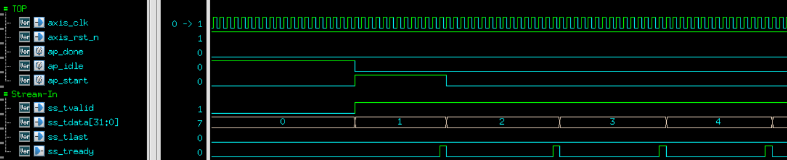

<!-- title: NYCU 2023 SoC-lab: FIR verilog RTL-simulation -->
NYCU 2023 SoC-lab: FIR verilog RTL-simulation
===
### This lab is the implementation of finite impulse response with n = 11. With only ***==1 Multiplier and 1 Adder==***, and ***==2 bram with 11 entry each==***. 
<br>

Folder hierarchy:
---
put the following files in the same director, nad make sure you have simulator to run verilog code.
- ***fir_tb.v*** 
- ***fir.v*** 
- ***bram11.v*** 
- ***samples_triangular_wave.dat***
- ***out_gold.dat***
- ***makefile***
<br>

Execute:
---

```Makefile
make run
make clean
```

Function spec:
---
$Y[n]$ = $\sum(H[i] * X[n-i])$ 

<br>


Design Spec:
---
- Data Width = 32
- Tape Num = 11 (Number of coefficients)
- Data Num = 600 (Number of input data)
- Interface:
  - data_in (Xn): AXI-STREAM 
  - data_out (Yn): AXI-STREAM
  - Coeff [10:0] : AXI-Lite
  - Data Num: AXI-Lite
  - ap_start: AXI-Lite
  - ap_done: AXI-Lite
- ==Using one Multiplier and one Adder==
  
<br>

Operation:
---
- ap_start to initiate FIR engine(ap_start valid for 1 cycle)
- Xn data in: AXI-Stream 
- Yn data out: AXI-Stream 

<br>

Configuration Register Address map:
---
0x00:
- [0]: ap_start, set when host axi-lite-write data = 1, reset when 1st axi-stream data comes in
- [1]: ap_done, when FIR process all the data, assert 1
- [2]: ap_idle, indicate FIR is actively processing data

0x10: data-length(600) <br>
0x20: Tap parameters (11 coefficients, 0x20, 0x24 ... 0x48)

<br>

Programming Sequence:
---


<br>

Test dataset:
---
- Samples_triangular_wave.dat (Xn)
- out_gold.dat (Expected Yn)
  
<br>

Waveform:
---

Coefficent Program into BRAM through axi-lite, and read back to check whether the coefficients are correct.<br>
Coefficients = {0, -9, -10, 23, 56, 63, 56, 23, -10, -9, 0}<br>

[**Configuration Write**]: program in coefficents and sent into BRAM directly (***AXI-Lite***):


[**Configururation Read**]: read back (***AXI-Lite***):<br>
After programmed in all coefficients, read back for checking.


Data-in-stream-in (***AXI-Stream*** handshake):<br>
I can only assert **ss_tready=1** every 11 cycles because I can only use 1 multiplier and 1 adder.<br>
**After ap_start=1, deassert ap_idle, and deassert ap_start when 1st axi-stream handshake occured.**


Data-out-Stream-out (***AXI-Stream*** handshake):<br>
I can only assert **sm_tvalid=1** every 11 cycles because I can generate 1 output (Yn) every 11 cycles.


Last data:
***After last AXI-Stream-In and AXI-Stream-Out, re-assert ap_idle=1, assert ap_done=1***<br>
Time from ap_start to ap_done is around ***9012*** cycles. 


